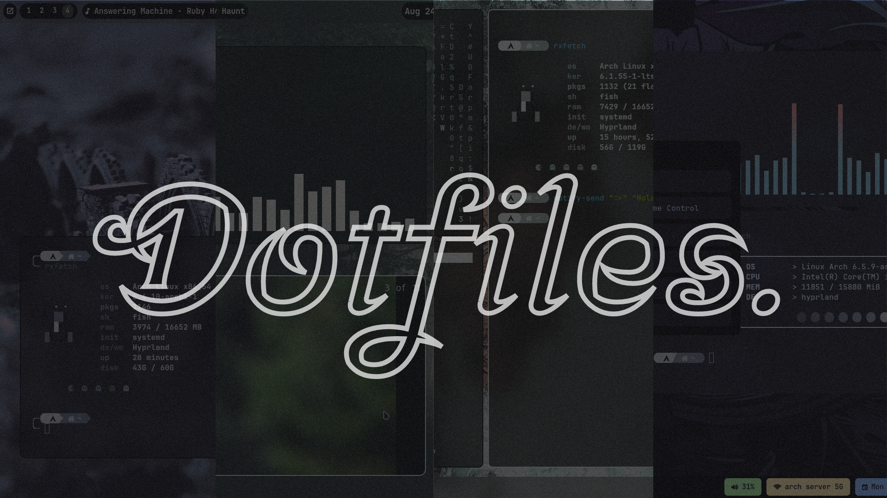
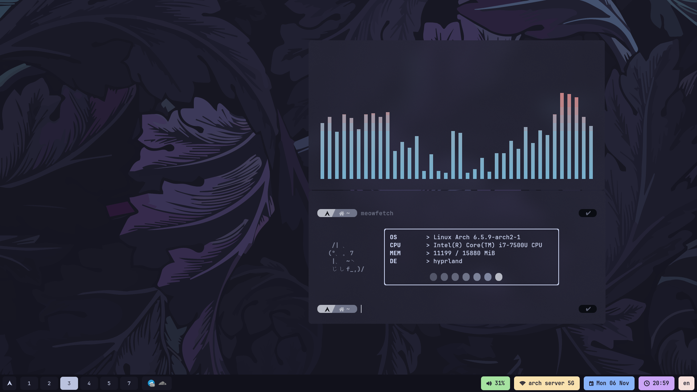
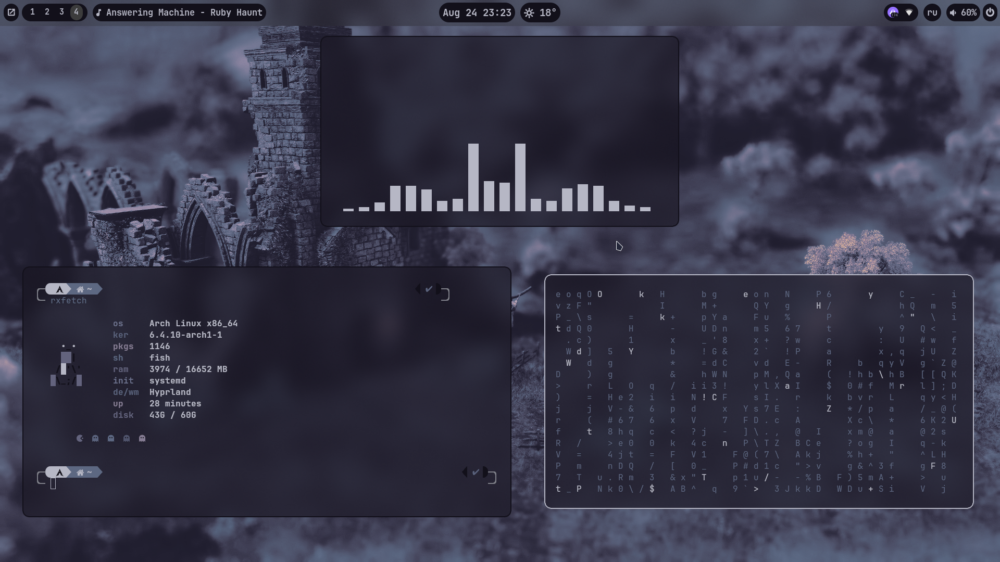

<div align="center">

</div>


<div align="center">
  <p></p>
  <h1 align="center">u1dm's dotfiles 🍁 </h1>
  
  
  
</div>


---


This is my personal collection of configuration files.

Here are some details about my setup:

```
       /\         u1dm@archpc
      /  \        os       Arch Linux 🍀
     /\   \       wm       Hyprland 🌺
    /      \      shell    Fish 🌹
   /   ,,   \     terminal Kitty 💐
  /   |  |  -\    laucher  rofi 🌾 
 /_-''    ''-_\   bar      waybar 🌼
```
---
**Mocha🍊**



---

**Monet🍎**



---

**Minimal🫐**


